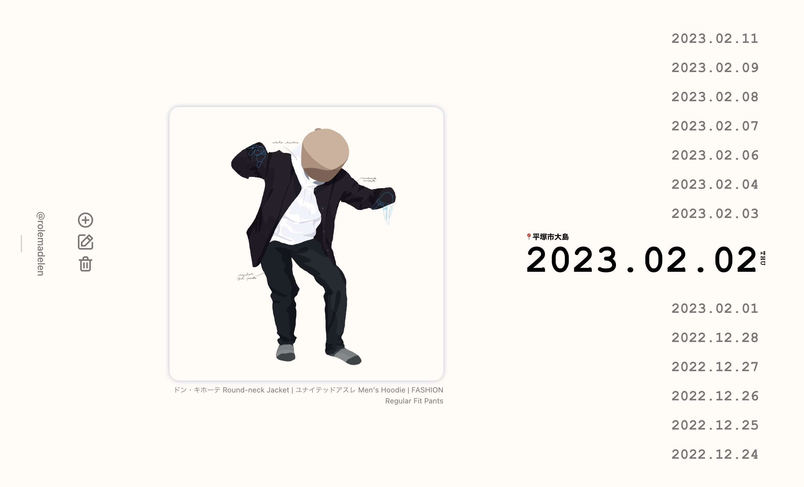

# Art Log

[Live Demo](https://artlogs.netlify.app/) - insert/edit/delete is disabled. Demo data are fetched from `demo.json` located in `client/src`.

Artlog is a daily art diary to document my daily outfit using Vite and MERN stack.

## Tech Stack
- Database
  + MongoDB
- Client
  + React
  + State Management
    * Redux Toolkit
  + Scss
  + Icons - [IconScout](https://iconscout.com/unicons/explore/line)
  + Axios
- Server
  + Express
